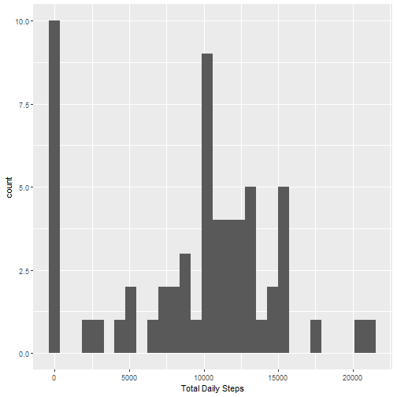
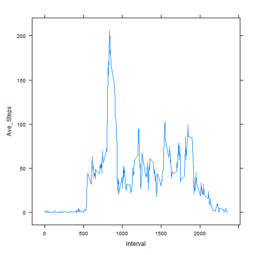
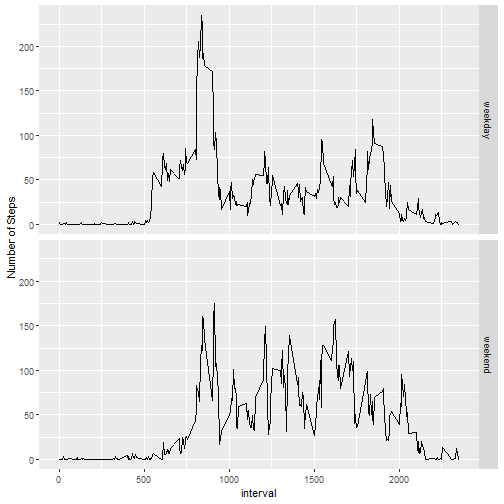

# Peer Graded Assignment 1

## Loading and Processing Data (NOTE:  I saved in my folder unzipped).

I'm adding a weekend/weekdy column


```r
library(dplyr)
```

```
## 
## Attaching package: 'dplyr'
```

```
## The following objects are masked from 'package:stats':
## 
##     filter, lag
```

```
## The following objects are masked from 'package:base':
## 
##     intersect, setdiff, setequal, union
```

```r
activity <- read.csv('activity.csv') 

activity <- activity %>% 
  mutate(date = as.Date(activity$date, "%Y-%m-%d"),
         Date_Type = if_else(weekdays(date) %in% c('Saturday','Sunday'), 'weekend','weekday'),
         Weekday = weekdays(date))
head(activity)
```

## What is mean total number of steps taken per day?

### Create Histogram

I group by date and then get the total number of steps


```r
library(ggplot2)
Total_Daily_Steps <- activity %>% 
  group_by(date) %>% 
  summarise(Total_Steps = sum(steps, na.rm=TRUE)) %>% 
  ungroup()

ggplot(data=Total_Daily_Steps, aes(x=Total_Steps)) +
  geom_histogram() +
  labs(x='Total Daily Steps')
```

```
## `stat_bin()` using `bins = 30`. Pick better value with `binwidth`.
```




### Summary statistics (including the mean and median) are shown below.  


```r
summary(Total_Daily_Steps$Total_Steps)
```

```
##    Min. 1st Qu.  Median    Mean 3rd Qu.    Max. 
##       0    6778   10395    9354   12811   21194
```

## What is the average daily activity pattern?

I group by interval and get the total number of steps


```r
Ave_Steps <- activity %>% 
  group_by(interval) %>% 
  summarise(Ave_Steps = mean(steps, na.rm=TRUE)) %>% 
  ungroup() 

library(lattice)
xyplot(Ave_Steps ~ interval, data = Ave_Steps, type = c("l"))
```




### What five minute interval contains the most steps?

Interval 835 (see below)


```r
max_interval <- Ave_Steps[Ave_Steps$Ave_Steps == max(Ave_Steps$Ave_Steps),]
max_interval
```

## Imputing Missing Values
There are 2304 missing cases


```
## [1] 2304
```

### Creating Dataset to replace missing values with average for interval

I create a column called steps_noNA that has the average steps for an interval
when the steps for that day aren't actually known


```r
activity2 <- activity %>% 
  left_join(Ave_Steps, by = 'interval') %>% 
  mutate(steps_noNA = ifelse(is.na(steps), Ave_Steps, steps))
```

### Histogram with corrected values


```r
Total_Daily_Steps2 <- activity2 %>% 
  group_by(date) %>% 
  summarise(Total_StepsNA = sum(steps, na.rm=TRUE),
            Total_StepsNoNA = sum(steps_noNA)) %>% 
  ungroup()
```

### Mean and Median with and without NAs

The mean and median are lower when missing values are present


```r
summary(Total_Daily_Steps2[,c('Total_StepsNA','Total_StepsNoNA')])
```

```
##  Total_StepsNA   Total_StepsNoNA
##  Min.   :    0   Min.   :   41  
##  1st Qu.: 6778   1st Qu.: 9819  
##  Median :10395   Median :10766  
##  Mean   : 9354   Mean   :10766  
##  3rd Qu.:12811   3rd Qu.:12811  
##  Max.   :21194   Max.   :21194
```

##Plotting by weekend/weekday


```
## `summarise()` has grouped output by 'interval'. You can override using the `.groups` argument.
```


